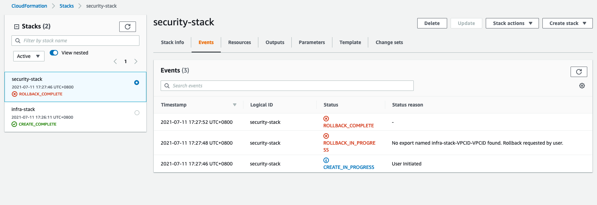

# aws-cfm-cross-stack

# Lab enviroment will be consist of below CFM template:
1. Create VPC and Custom Security Group
2. Create 3 public subnet

# IP Addresss assigments 
```
sgpvpc - 192.168.0.0/16
sydvpc - 172.16.0.0/16
tkovpc - 10.10.0.0/16
```

# Steps: 
## 1. Create VPC with 3 Public Subnet x 3 AZ & Export VPC ID
- [infra-stack.yaml](./Templates/infra-stack.yaml)

### `cloudideastarMasterVpc1` & `publicSubnet1,publicSubnet2,publicSubnet3` on "ap-southeast-1a" "ap-southeast-1b" "ap-southeast-1c"
```bash
cross-stack aws cloudformation create-stack --stack-name infra-stack --template-body file://infra-stack.yaml
```

### Check cfm stack
```bash
aws cloudformation describe-stacks
```

## 2. Create Custom Security Group & Import VPC ID 
- [security-stack.yaml](./Templates/security-stack.yaml)

### `cloudideastar-master Custom Security Group ` 
```bash
Cross-stack aws cloudformation create-stack --stack-name security-stack --template-body file://security-stack.yaml --parameters ParameterKey="infraStackName",ParameterValue="infra-stack"
```
### Check cfm stack
```bash
aws cloudformation describe-stacks
```

### When parameter is wrong 

